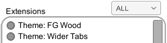
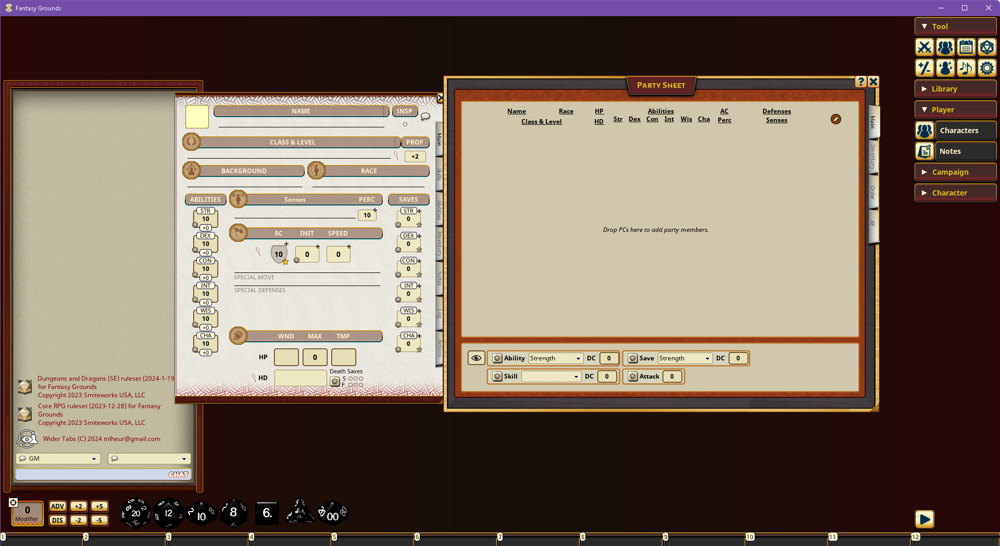
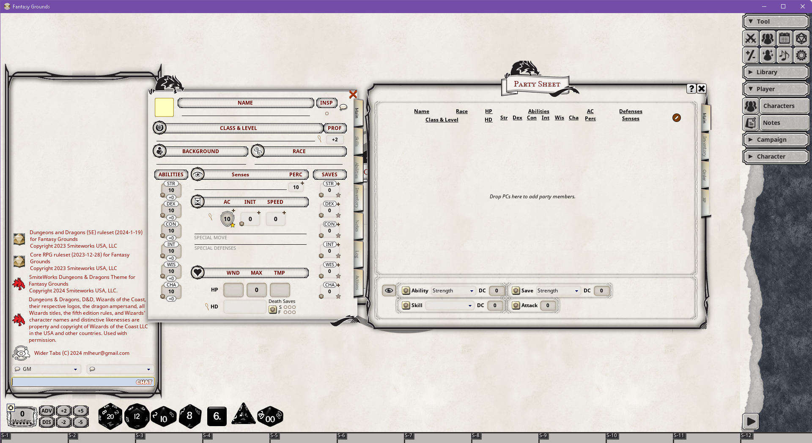
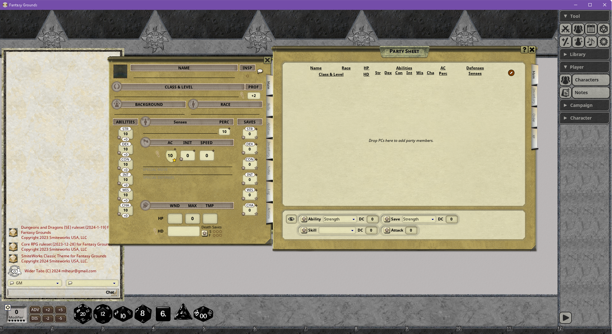
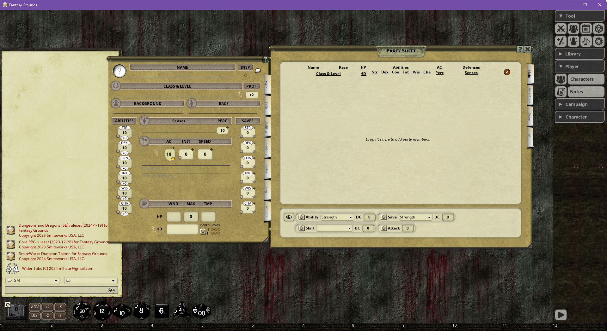
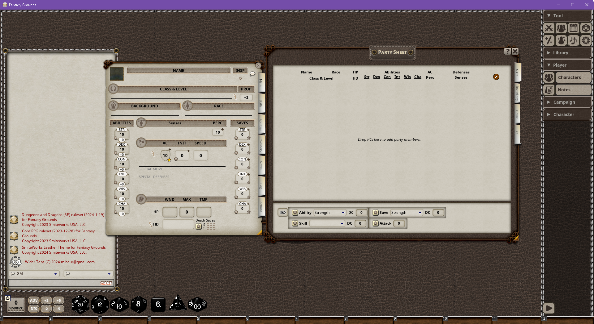
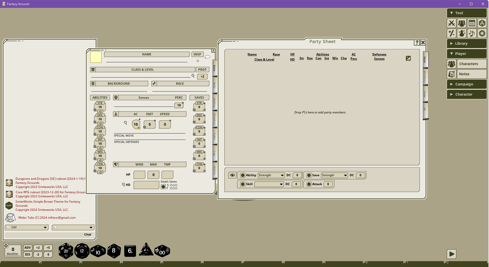
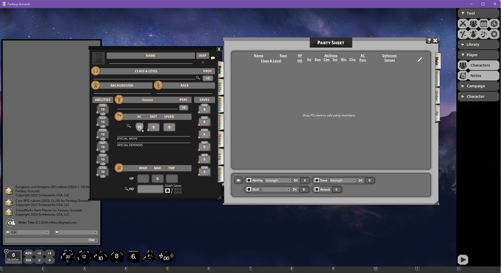
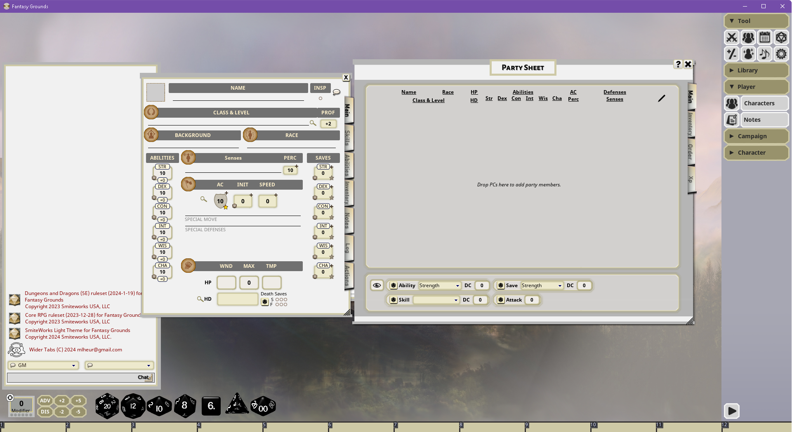
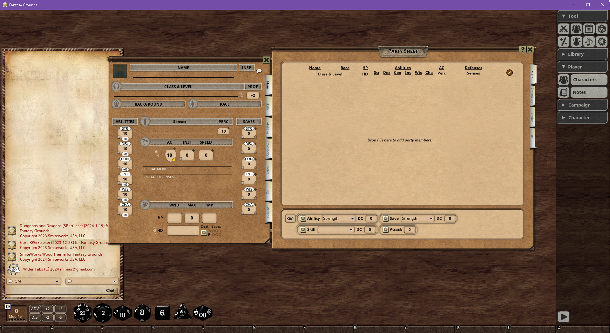

# FGU Theme: Wider Tabs
A theme add-on to put wider tabs on other themes in 5E campaigns in Fantasy Grounds Unity.

## Server/Host Installation Instructions
### Confirm Data directory
```
C:\>reg query "HKCU\SOFTWARE\SmiteWorks\Fantasy Grounds" /v DataDir
HKEY_CURRENT_USER\SOFTWARE\SmiteWorks\Fantasy Grounds
    DataDir    REG_SZ    C:\Games\FGU\Data
```
### Change to the extensions directory
```
C:\>cd /d "C:\Games\FGU\Data"\extensions
```
### Get the wider tabs theme
 - cd ...\Data\extentensions
 - git clone https://github.com/mlheur/Theme_WiderTabs
 - enable theme extension "Theme: Wider Tabs" when creating or loading a campaign.
 - enable any other themes as you like
# Screenshots

## Enable both themes ...


## ... then it will look like one of these

No other theme selected:


D&D Official:


Classic:


FG Dungeon:


FG Leather:


FG Simple Brown:


FG Simple Grey:


FG Dark:


FG Light


FG Wood:
